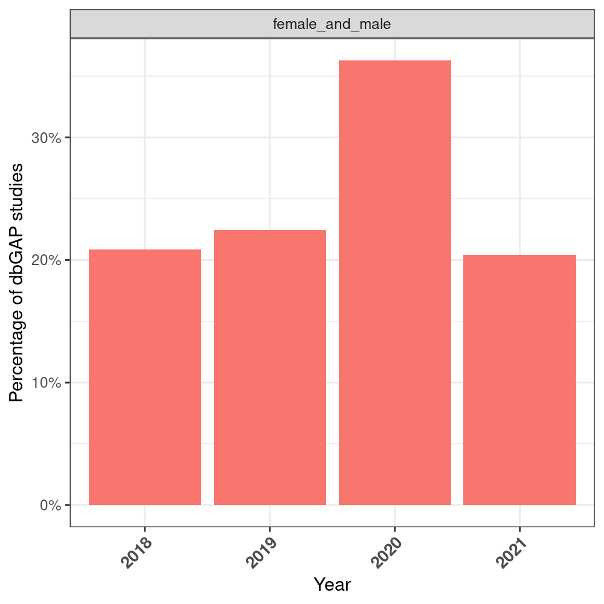
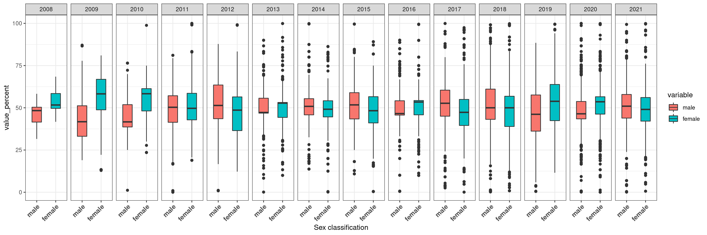
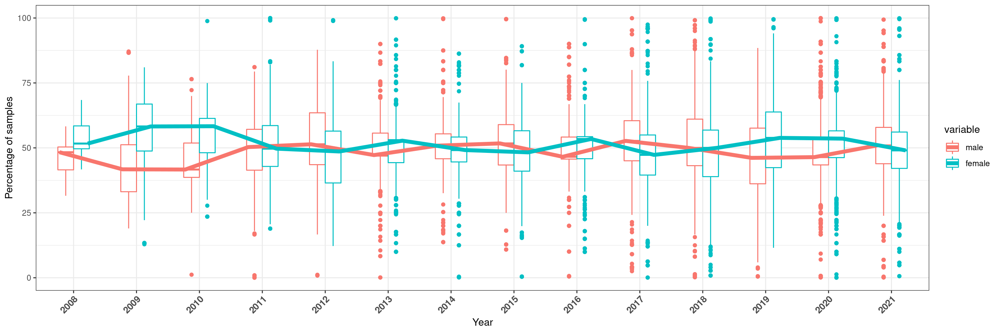

# Results from filtered_summary.csv

- Considering all dates
  - Number of studies: 7,864
  - Number of samples (not unique): 18,502,714
- Considering date >= 2018:
  - Number of studies: 4,315 (2 times more studies than EGA)
  - Number of samples (not unique): 10,547,994 (almost 10 times more samples than in EGA). 

**All the samples of this dataset are categorized by biological sex**. No "unknown" samples are present. 

## Quantification at the sample level

### globally 

### annually

### Same as the previous, but  male and female together
This plot made sense in EGA but not here I think! Nevertheless, it's another representation just in case. 

### Mean percentage of samples by sex included in ALL the studies

The plot below is the same as the one above but including lines to ease the visualization across the years. 

## Quantification at the study level
All studies (7,864) contain always both female and male data. 

