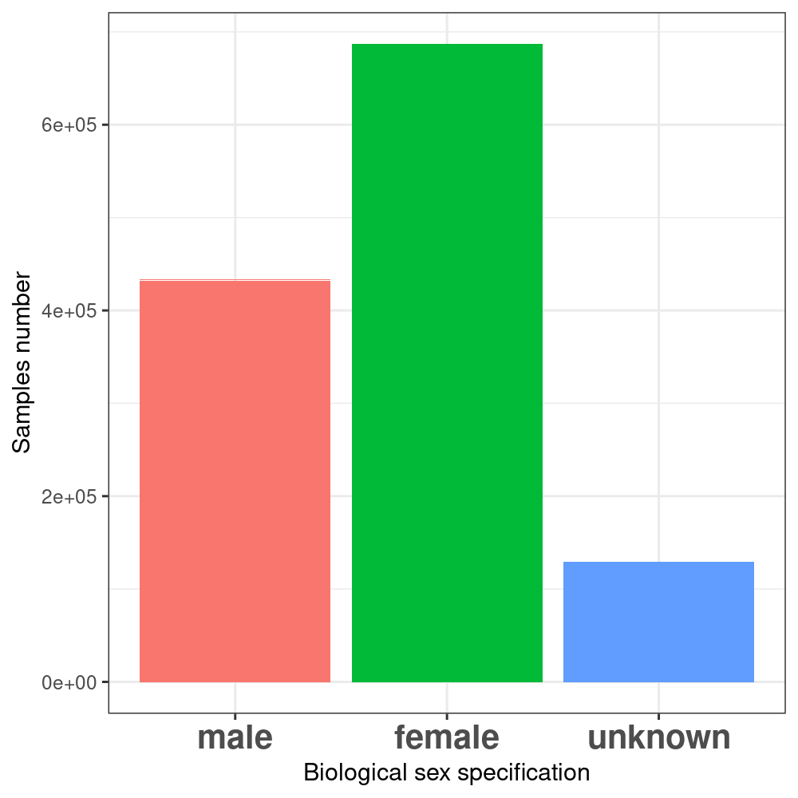
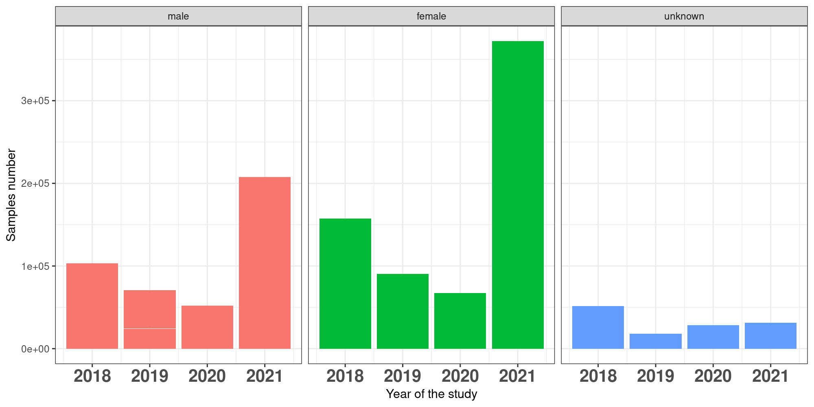
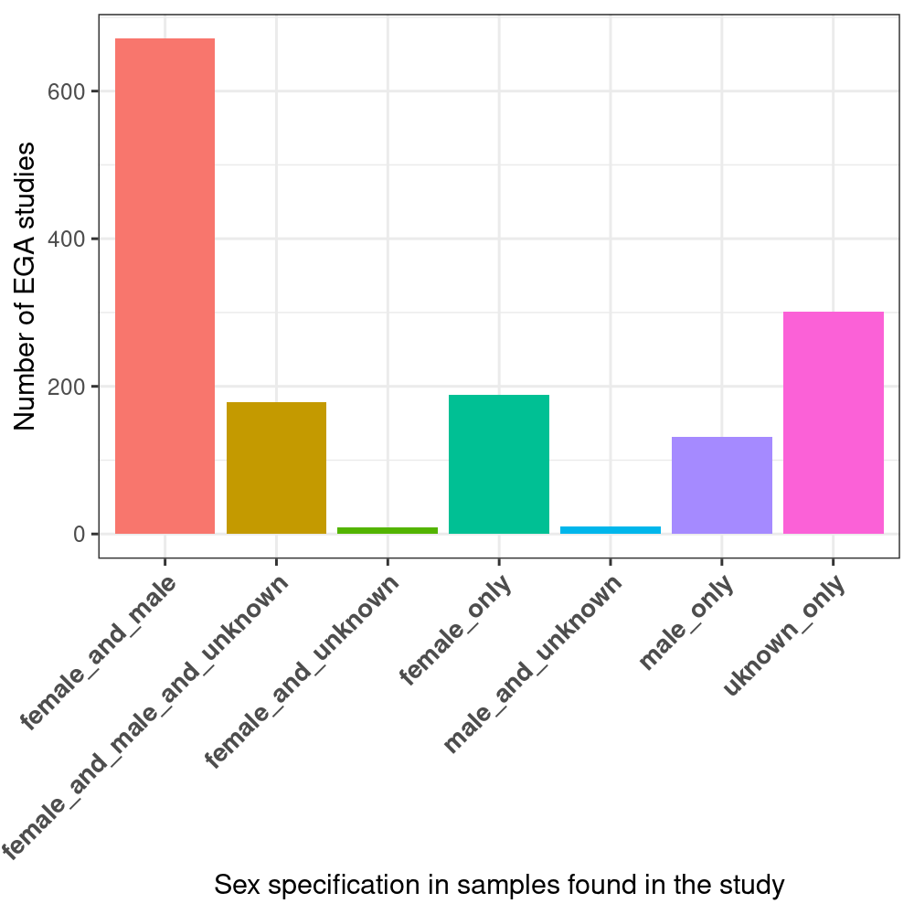
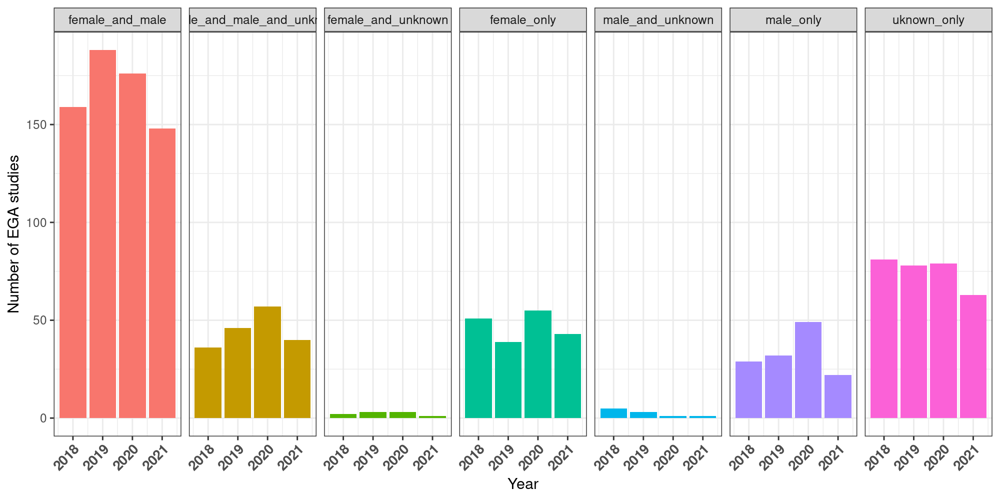

# Summary of results from file "EGA_with_NULL.csv"

The total number of studies from 2018 to date (9 Nov 2021) is 1,490 with a total number of 1,249,255 samples. Some studies include samples from before 2018, i.e.: the gender was not mandatory to be specified. As a result we find samples corresponding to the 'unknown' class. 

## Quantification biases at the sample level

### Globally

### Anually

## Quantification biases at the study level

### Globally
  - 20% (301) of the quantified studies do not report biological sex in their samples. 
  - 13 % (198) allow some uncertainty in their samples regarding biological sex (i.e.: unknown samples are included together with female and/or male samples.)
  - 67% (991) of the studies report the biological sex of all the considered samples.

### Anually

# Summary of results from file "raw_data_sample_tag.txt"
- 704,732 unique samples
- 1487 studies
- 4289 phenotypes

# Results from file "raw\_data"

## Processing of the data

From the key value data file we extracted all the studies with gender and counted the gender in order to have a table like the following

| study | males | females | unknown |
|---    |---    |---      |---      |

We then filtered out the studies having less than 100 samples in their data and otained a _pertinent_ studies set of 556 studies.

## Results

### Summary of known and unknown gender
Despites the fact that since 2018, EGA made the inclusion of sex in the data mandatory, some studies are still using old samples. This explains the presence of some studies having an unknown gender and a non specified gender.
We excluded the studies that have a non specified gender, but we computed the count of studies with unknown sex.  

Studies that only used data with sex marked: **276**.
Studies that used all the data with unknown sex: **93**.

### Summary of gap in sex

To measure the relative gap of sex representation we only included studies that have at least 1 male and 1 female which resulted in a dataset of 386 studies.

From there we measure the relative gap as #females/(#males+#females) - #males/(#males+#females).  
On average the gap in the studies is -12%.
Which means that on average each study has a data set with 12% less women than men.
