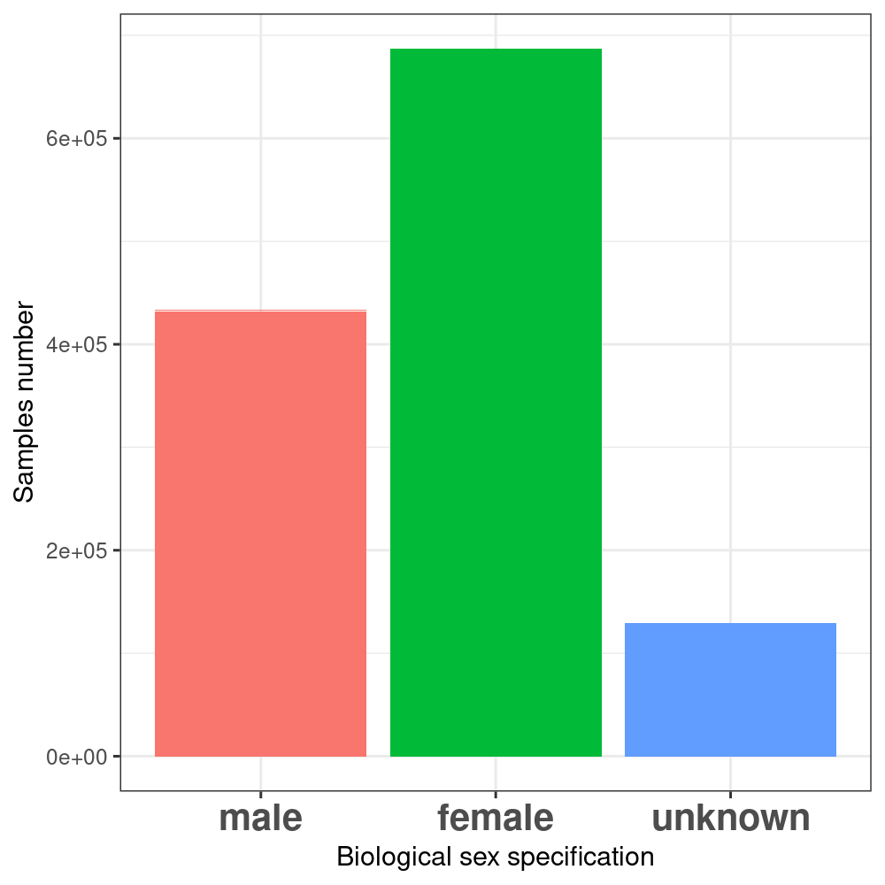
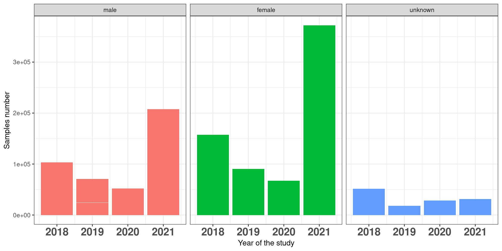
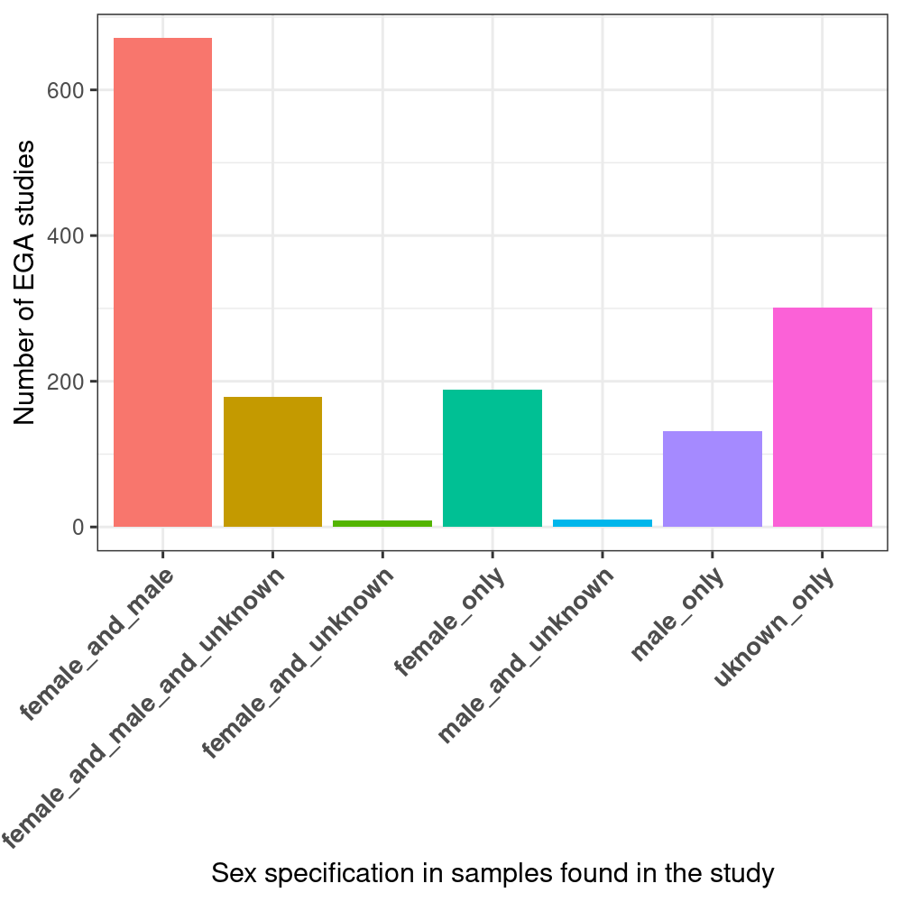
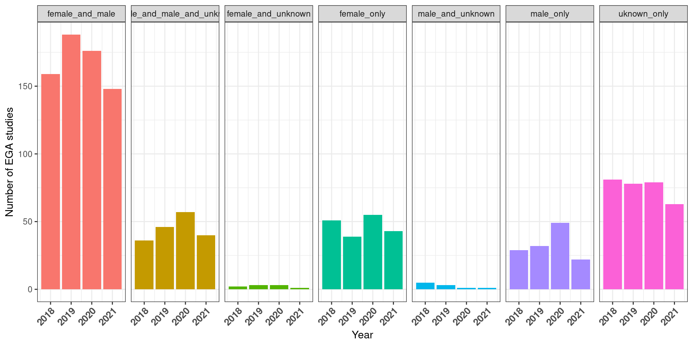

# Summary of results from file "EGA_with_NULL.csv"

The total number of studies from 2018 to date (9 Nov 2021) is 1,490 with a total number of 1,249,255 samples. Some studies include samples from before 2018, i.e.: the gender was not mandatory to be specified. As a result we find samples corresponding to the 'unknown' class. 

## Quantification biases at the sample level

### Globally

### Anually

## Quantification biases at the study level

### Globally
  - 20% (301) of the quantified studies do not report biological sex at all in their samples. 
  - 13 % (198) allow some uncertainty in their samples regarding biological sex (i.e.: unknown samples are included together with female and/or male samples.)
  - 67% (991) of the studies report the biological sex of all the considered samples .

### Anually

