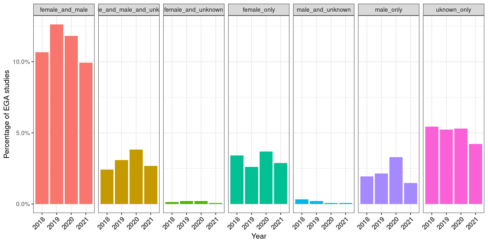

# Summary of results from file "EGA_with_NULL.csv"

The total number of studies from 2018 to date (9 Nov 2021) is 1,490 with a total number of 1,249,255 samples. Some studies include samples from before 2018, i.e.: the gender was not mandatory to be specified. As a result we find samples corresponding to the 'unknown' class. 

## Quantification biases at the sample level

### Globally

### Anually

## Quantification biases at the study level

### Globally
  - 20% (301) of the quantified studies do not report biological sex in their samples. 
  - 13 % (198) allow some uncertainty in their samples regarding biological sex (i.e.: unknown samples are included together with female and/or male samples.)
  - 67% (991) of the studies report the biological sex of all the considered samples.

#### Sample distribution in "female_male_unknown", "female_unknown" and "male_unknown" groups
From the previous classification, we focus on the group of studies that contain unknown sex classification and quantify the number of unknown samples as well as male and female included in this studies (it's the total number of samples, not unique number)

Is the inclussion of unknown classification justified? The phenotype could be self explanatory of the sex. 

**Female_and_male_and_unknown phenotypes of UNKNOWN SEX samples**

We find 247 phenotypes. Many of them are not sex specific. 

**Female_unknown phenotypes of UNKNOWN SEX samples**
Only 1 sample is sex-specific. 
|phenotype            | number of samples|
|:--------------------|-----------------:|
|Breast cancer        |                 1|
|cancer               |                 4|
|Case                 |                 1|
|Cell line            |                 1|
|**cervical cancer      |                 1**|
|healthy              |                16|
|mixed                |                 1|
|Tumour               |                54|
|Tumour Cell line RNA |                34|

**Male_unknown phenotypes of UNKNOWN SEX samples**

No sample is sex-specific in this case. 

|phenotype                                                                                                        | number of samples|
|:----------------------------------------------------------------------------------------------------------------|-----------------:|
|AML                                                                                                              |                 3|
|Blood                                                                                                            |                88|
|Bone Marrow                                                                                                      |                 5|
|Breast Adenocarcinoma, Lung Adenocarcinoma, Lung Adenocarcinoma, Lung Adenocarcinoma, Spontaneously immortalized |                 1|
|Control                                                                                                          |                 8|
|Fetal liver stem cells and fetal intestinal stem cells                                                           |                45|
|Gastrointestinal                                                                                                 |               141|
|Lung cancer                                                                                                      |                 4|
|lung cancer organoid                                                                                             |                 2|
|lung cancer tissue                                                                                               |                 2|
|Not supplied                                                                                                     |                34|
|QPD                                                                                                              |                13|
|unknown                                                                                                          |               192|

### Anually

# Summary of results from file "raw_data_sample_tag.txt"
- 704,732 unique samples
- 1487 studies
- 4289 phenotypes

## Unique classification of samples

## Distribution of samples classification by date of dataset release
Datasets might have the released date to the lowest date as of 2001. This means that we do not have the release date to that dataset.
Samples without released date constitute 48% of the samples contained in studies from 2018 onwards. For 16% of these sample without release date, sex classification is unknown. 

- The idea here is to give a recommentadion on how to reuse old samples, use those that contain sex classification. 
- Another point to raise is: if in 2018 sex is mandatory to be reported, why for some samples after this date we find 'unknown' classification. Perhaps something is messed up with the upload date. 

## What's the tendency of the selected studies to reuse samples?
We check the number of studies per year that include at least one sample from unknown released date and we see it's a common practice across studies and along the years. 

And we check how's the samples dates distribution according to the year of the study. 

- These results reinforce the idea on how to reuse old samples.

# Summary of results from file "all_EGA_samples.txt"

# Results from file "raw\_data"

## Processing of the data

From the key value data file we extracted all the studies with gender and counted the gender in order to have a table like the following

| study | males | females | unknown |
|---    |---    |---      |---      |

We then filtered out the studies having less than 100 samples in their data and otained a _pertinent_ studies set of 556 studies.

## Results

### Summary of known and unknown gender
Despites the fact that since 2018, EGA made the inclusion of sex in the data mandatory, some studies are still using old samples. This explains the presence of some studies having an unknown gender and a non specified gender.
We excluded the studies that have a non specified gender, but we computed the count of studies with unknown sex.  

Studies that only used data with sex marked: **276**.
Studies that used all the data with unknown sex: **93**.

### Summary of gap in sex

To measure the relative gap of sex representation we only included studies that have at least 1 male and 1 female which resulted in a dataset of 386 studies.

From there we measure the relative gap as #females/(#males+#females) - #males/(#males+#females).  
On average the gap in the studies is -12%.
Which means that on average each study has a data set with 12% less women than men.

### Summary of all bias datasets

We found that dome datasets are completely biased towards one of the sexes.  
There are **50** studies use datasets where all the samples are females.  
There are **24** studies use datasets where all the samples are males.  

In some cases this _bias_ makes since.
For example it does not make sense to have females in the data for a study for prostate cancer.
Nevertheless some studies are for general purpose and use only one sex for it.
Other diseases like breast cancer affect both sexes but are more common for only one.
Ideally those studies should consider both sexes but it kind of makes sense that only have one.

|                     | **only males** | **only females** |
|---------------------|----------------|------------------|
| makes sense         | 14             | 19               |
| does noe make sense | 10             | 20               |
| could make sense    | 0              | 11               | 

