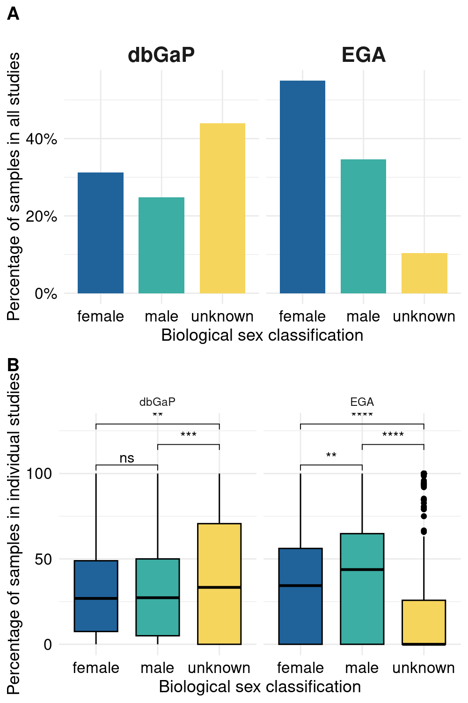
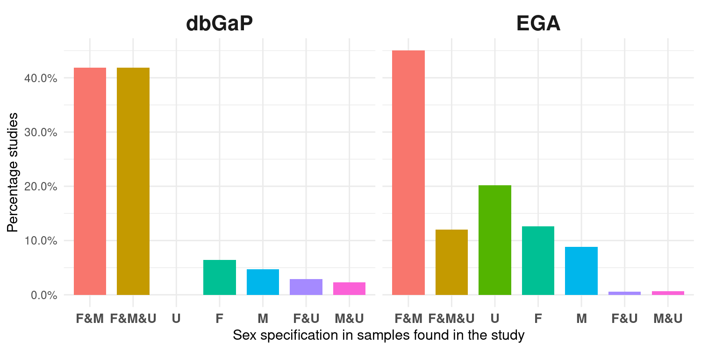

# **Addressing sex bias in biological databases worldwide**

Victoria Ruiz-Serra 1,# , Nataly Buslón 1,#,\*, Olivier R. Philippe 1, Diego Saby 2, María Morales 1, Camila Pontes 1, Alejandro Muñoz Andirkó 3, Gemma L. Holiday 4, Aina Jené 5, Mauricio Moldes 5, Jordi Rambla 5, Alfonso Valencia 1,6, María José Rementeria 1, Átia Cortés 1,#, Davide Cirillo 1,#,\*

\# these authors contributed equally

\* corresponding authors: Davide Cirillo, [davide.cirillo@bsc.es](mailto:davide.cirillo@bsc.es); Nataly Buslón, [nataly.buslon@bsc.es](mailto:nataly.buslon@bsc.es)

1Barcelona Supercomputing Center (BSC), Barcelona, Spain

2Gedesco Services, Spain

3DevCenter, Alicante, Spain

4Medicines Discovery Catapult, Macclesfield, United Kingdom

5Centre for Genomic Regulation (CRG), Barcelona, Spain

6Institución Catalana de Investigación y Estudios Avanzados (ICREA), Barcelona, Spain

Keywords: sex bias, gender bias, artificial intelligence, metadata reporting, human genomic databases, research data repositories

## **Abstract**

Precision medicine aims at tailoring treatments to individual patient needs. In this context, artificial intelligence (AI)-based technologies are viewed as revolutionary since they have the capacity to identify key features that link genomic and phenotypic traits at the individual level. AI techniques therefore depend on the quantity and quality of patient data. When variables like sex, age, or race are ignored in sample records, it can result in biased predictions as they will not be considered in the training of the AI algorithm. To this end, the European Genome-phenome Archive (EGA) took action in 2018 and put into place a rule that requires data providers to declare the sex of donor samples uploaded into their repository to improve data quality and prevent the spread of biased results.

In this work we quantified biases in sex classification over time in human data from studies deposited in EGA and the database of Genotypes and Phenotypes (dbGaP), which represents the EGA's equivalent in the USA. The main result is that the EGA policy is effective to fight sex classification biases because there are significantly less samples classified as unknown after 2018 in this repository than in dbGaP. Additionally, we qualitatively assessed public opinion on this issue. A survey addressed to users, creators, maintainers, and developers of biological databases revealed that specialized training and additional knowledge about diversity criteria are required. Based on our findings, we raise awareness of sample bias problems and provide a list of recommendations for enhancing biomedical research practices.

## **Introduction**

The "one-size-fits-all" view of medicine is no longer considered the paradigm; instead, it is well understood that the diversity of nature is reflected in our response to treatments. Precision medicine, in which treatments are tailored to individuals, only works if we have a proper understanding and exhaustive evidence of the underlying inter-individual differences, especially if it relies on the use of Artificial Intelligence (AI) [@cirillo_sex_2020]

The successful application of AI to the health domain is a major achievement in science and technology [@rajpurkar_ai_2022]. AI for health is particularly thriving in the domains of medical imaging and digital medicine, with successful applications in digital pathology [@baxi_digital_2022] and wearable technologies [@iqbal_advances_2021]. To present, 64 AI-based medical devices and algorithms have been identified [@benjamens_state_2020]. Moreover, as of February 2022, the ACR Data Science Institute AI Central reports a total of 160 FDA-cleared AI medical products related to radiology and imaging [@noauthor_ai_nodate], while ClinicalTrial.gov reports a total of 105 completed and 41 active AI-related clinical trials [@noauthor_clinicaltrialsgov_nodate].

Such systems learn to perform specific tasks by processing extensive amounts of data produced and generally stored in large repositories and knowledge bases. In the area of human data collection, two of the largest databases worldwide are the database of Genotypes and Phenotypes (dbGaP) at the National Center for Biotechnology Information (NCBI) [@noauthor_dbgap_nodate-1] and the European Genome-phenome Archive (EGA) at the European Bioinformatics Institute (EBI) and the Centre for Genomic Regulation (CRG) [@noauthor_ega_nodate]. As outlined by the FAIR Principles [@noauthor_fair_nodate], such resources are key to biomedical research, especially with AI applications, but only if they are well-maintained and efficiently operated through good data management practices. Indeed, the quality and content of these data have an immense impact on what and how AI learns. The use of AI can produce discriminatory results and spread them throughout society if the data have biases, such as an inaccurate representation of some demographic groups or missing data. Concerns about the risk of AI to incur ethical issues have been recently pointed out, particularly in relation to sex and gender bias in AI [@cirillo_sex_2020].

Taking as a reference the interpretation of Office for National Statistics (ONS) and the UK government, biological sex refers to the "biological aspects of an individual as determined by their anatomy, a product of their chromosomes, hormones, and their interactions". Whereas gender is a social construction which "is a personal, internal perception of oneself and so the gender category someone identifies with may not match the biological sex they were assigned at birth" [@noauthor_what_nodate]. In June 2015, the NIH announced that sex as a biological variable must be part of research design and analysis in studies of vertebrate animals and humans (NOT-OD-15-102). Moreover, major granting agencies require sex and gender analysis to be integrated in research design [@noauthor_sex_nodate] although their inception followed different timelines (e.g. WHO was in 2002, whereas Korea was in 2021). Despite such requirements, the metadata associated with human data repositories are still relatively poorly accounted for.

In this article, we evaluate the current sex bias in dbGaP and EGA. By analyzing the existence or absence of such categories in the metadata of the submitted studies and samples, we may ascertain the degree of sex and gender bias in the EGA and dbGaP human data repositories. We use data collected since 2018 to quantify the global sex bias and its evolution over time. Additionally, we conducted a survey to analyze the practice of the experts in reporting sex and gender metadata in human databases. We offer a series of recommendations based on our observations to encourage ethical methods in the gathering, sharing, and applying biological data.

## **Results**

**1. Sex balance in EGA and dbGaP studies since 2018**

Following the new metadata model introduced by the European Nucleotide Archive (ENA) [@silvester_european_2018], the EGA repository mandated the sex category for all data submissions in 2018. On the other hand, dbGaP imposed such regulation from 2019 but only when submitting variants (VCF and PLINK files) data [@noauthor_dbgap_nodate]. Using this difference between the two repositories, we collected the sex classification reported in the samples of the studies accumulated in EGA and dbGaP from 2018 up to the date of the data retrieval (November 2021). We then compared the results of the two databases to assess the impact of this regulation.

The majority of the samples in EGA (1,249,255 total samples over 1,490 studies) were classified as female (F=55%), followed by male (M=35%) and unknown (U=10%) (**Figure 1)**. Similar results were observed when we counted the sex reporting if we took into account the unique number of samples (705,502 samples; [**Figure S1**](https://docs.google.com/document/d/1C4QGUgH4dm17WqPRULSOAnT1cj0dJ6j4E-bvs-ANpLY/edit#)). The number of female and male samples was more evenly distributed in dbGaP (31% female and 25% male), which comprised around 7 times as many samples (7,036,375) in half as many studies (753) as EGA. However, the bulk of the samples (44%) fits the unknown category.

We divided each study into categories based on the sex of their sample populations (**Figure 2**). While the majority of studies in dbGaP (51.3%) used samples that were female, male, and unknown (F&M&U), the majority of studies in EGA (45%) used samples that were female and male (F&M). Studies with both female and male samples (F&M=23.5%) made up the second most common classification in dbGaP, while in EGA corresponded to studies with only unknown samples (U=20%), a classification represented in 10.2% of dbGaP studies. We found that there were more studies with only female (F) samples (10% in dbGaP and 12% in EGA) than with only male (M) samples (7% in dbGaP and 8% in EGA). Lastly, studies with female and unknown (F&U) or male and unknown (M&U) samples were the least common in EGA (F&U=0.6% and M&U=0.7%), however, they were the fourth and fifth most common classes in dbGaP (F&U=5% and M&U=2.4%).

In conclusion, our analysis showed that it is not only important to quantify the general biases in the samples, but also their distribution within individual studies. EGA studies contained a lower number of unknown samples, mostly studied on their own, i.e. unknown-only studies. Male and female samples, however, were unequally distributed, with female samples being more prevalent. Nevertheless, the fact that both the biologically male and female sexes were represented in over half of the research is a positive finding. In contrast, although the representation of male and female samples in dbGaP was more balanced, this finding is tainted by the substantial amount of unknown samples, which are usually included in studies that contain both male and female samples data.

**Figure 1.** Barplot depicting the distribution in percentage of the sex classification in all the EGA and dbGaP samples (not unique) included in studies from 2018 to the date of data retrieval (November 2021).

**Figure 2.** EGA and dbGaP studies (2018-2021) classification according to the sex representation of their samples. F, female; M, male and U, unknown.

**2. Sex balance across time**

We expanded the prior study and looked at all potential samples kept in both EGA and dbGaP repositories over time to have a better understanding of the evolution of female and male representation in research projects. In this way, we quantified the effect of the 2018 EGA policy and assessed how the sex classification of samples has changed over a longer time period. The collected data represented a period of over ten years, starting in 2009 for dbGaP and in 2010 for EGA, and they comprised a total of 1,340 dbGaP and 2,918 EGA studies, with 13,583,555 and 2,415,781 samples, respectively. [**Figures S2** and **S3**](https://docs.google.com/document/d/1C4QGUgH4dm17WqPRULSOAnT1cj0dJ6j4E-bvs-ANpLY/edit#) show the total number of studies over the years and the total number of samples included in each sex classification respectively.

We first analyzed the temporal sex classification distribution of dbGaP and EGA samples ( **Figures 3** and **4** respectively). Regarding dbGaP, the years with the highest submitted samples, 2017, with 3,169,377 samples, and 2020, with 3,573,690 samples ( **Figure 3A** ), correlated to the years with the largest percentage of unknown samples ( **Figure 3B** ). This proportion is maintained when looking at the mean number of samples per study, meaning that the inclusion of a high number of unknown samples is shared among studies ([**Figure S4**](https://docs.google.com/document/d/1C4QGUgH4dm17WqPRULSOAnT1cj0dJ6j4E-bvs-ANpLY/edit#)). In the case of EGA, we observed a significant impact of the 2018 policy since the distribution of the unknown samples are, for the first time, in a notably lower proportion than female and male samples ( **Figure 4B** ). Between 2010 and 2013, more than 75% of the samples were labeled as unknown. We observed that this percentage drastically dropped to 50-25% in 2014 and remained comparable to male and female samples proportions for 4 years. Since 2018, unknown samples represent less than 20% of the samples and reached a minimum of 5% in 2021. Unlike dbGaP, sample data peaks in 2014 (463,524 samples) and 2021 (606,108 samples) did not coincide with the largest percentage of unknown samples ( **Figure 4A** ). Since 2010, there has been an equal distribution of male and female samples; however, this is no longer the case as of 2017, since we consistently saw more female samples being used in EGA studies than male ones ( **Figure 4B** ).

We also analyzed the studies according to the sex classification of their samples across the years in dbGaP and EGA ( **Figure 3C** and **4C** respectively). Independently of the year, while between 20% to almost 70% of the dbGaP studies were always represented by F&M and F&M&U classifications, the rest of study classifications (F, M, U, F&U and M&U) were never superior to 20% of the total ( **Figure 3C** ). We want to highlight that the F&M&U category masks a problem of unlabeled data as the median proportion of samples per studies was always superior to male and female proportions throughout the years ([**Figure S4**](https://docs.google.com/document/d/1C4QGUgH4dm17WqPRULSOAnT1cj0dJ6j4E-bvs-ANpLY/edit#)[)](https://docs.google.com/document/d/1C4QGUgH4dm17WqPRULSOAnT1cj0dJ6j4E-bvs-ANpLY/edit#). The previous is not observed in EGA and, in fact, the median number of unknown samples per study dropped over time, especially after 2016. Regarding EGA, 100% of the studies contained only unknown samples (U) in 2010 ( **Figure 4C** ). This value gradually decreased, reaching its minimum (~20%) in 2021. After 2013, at the same time that the unknown only studies decreased, mixed studies increased. F&M studies began to outnumber all other types in 2016, reaching their peak in 2019 and 2021 when they accounted for about 50% of all studies. It seems that independently of the 2018 regulation, there was already a good practice of not performing studies with unknown only samples, especially since 2016, which is likely further benefited by the new policy.

In summary, we were able to identify sex representation biases in the EGA and dbGaP repositories by quantifying data changes across time. From our results we conclude that the EGA 2018 policy has evidenced that a change of course is possible in the sex classification of samples as we observed a drastic reduction of the number of unknown samples. In contrast, by grouping the studies according to their sex representatives (for example, F&M&U) rather than analyzing all of them together, we revealed an alarming high presence of samples classified as unknown in recent years in dbGaP studies compared to EGA ones.

**Figure 3.** Quantification and sex classes distribution of dbGaP samples included in studies from 2009 to November 2021. (A) represents the total number of samples used in dbGaP studies per year, (B) depicts the sex classification distribution in percentage of the used samples in dbGaP studies yearly and (C) shows studies classification according to the sex representation of their samples across time. F, female; M, male and U, unknown. 'NA' refers to no date record.

**Figure 4.** Quantification and sex classes distribution of EGA samples included in studies from 2010 to November 2021. (A) represents the total number of samples used in EGA studies per year, (B) depicts the sex classification distribution in percentage of the used samples in EGA studies yearly and (C) shows studies classification according to the sex representation of their samples across time. F, female; M, male and U, unknown. 'NA' refers to no date record.

**3. Misrepresentation of one of the sexes in studies is not always justified**

In addition to the absence of sex information in biological samples, studies that only take into account one of the two biological sexes and draw conclusions about the population represent a significant bias in biomedical research. In light of this, we evaluated which traits are more prevalent in females compared to male populations and to what extent the consideration of only one sex category in dbGaP and EGA studies is justified.

**Figure 5** shows the female to male ratio per phenotype and highlights some of the phenotypes. We calculated this ratio per each study ID and the mean ratio when different studies corresponded to the same phenotype. The full table is in [**Supplementary Table 1**](https://docs.google.com/spreadsheets/d/1uDAe9GtxCtoP2L3H2HXZxV_IepnHJYvVWLVS2g5xYpg/edit#gid=2067138533). While dbGaP phenotypes are more homogeneously represented in the form of "primary phenotype", in the case of EGA is a free text variable. Therefore, in the case of dbGaP, all phenotypes are represented in the plot (n=536) while in the case of EGA only the top 100 phenotypes with more samples are shown. In both repositories we observed phenotypes that are sex-specific, like menopause or prostate neoplasm in dbGaP or preeclampsia in EGA, present in both males and females (otherwise they would not appear in the plot at all), which made us realize that subjects are classified sometimes by gender instead of sex but we warn the reader that in the rest of cases we have no way of knowing whether classification was based on sex or gender. According to dbGaP, more female samples were studied that suffered from cardiovascular disease and chronic obstructive pulmonary disease (COPD) and from multiple sclerosis and obesity regarding EGA repository. In the case of male samples, diseases such as diabetes and autism were more studied in dbGaP and bladder cancer and urothelial cancer in the case of EGA. Overall, if there is more incidence of a disease among a certain population, such as females or males, it is expected that more samples of that population will be studied. However, some diseases can affect both female and male populations and only one is represented in the study. Therefore, we next evaluated if there is enough justification to include only one of the sexes in the study of a phenotype.

We selected the studies that contained only _female_ or _male_ samples and at least 100 samples. 29 out of the 94 selected studies (dbGaP=6 and EGA=23) contained only male samples and the rest (dbGaP=17 and EGA=48) only female samples. We manually labeled them as 'adequate' or 'not adequate' if the study of a single sex is justified or not as the phenotype is sex-specific ([**Supplementary Table 2**](https://docs.google.com/spreadsheets/d/1uDAe9GtxCtoP2L3H2HXZxV_IepnHJYvVWLVS2g5xYpg/edit#gid=2067138533)), considering also 'adequate' cases when the incidence of a certain phenotype is higher for one of the sexes, such as breast cancer and the sex bias is partly justified. In total, 4% and 28% of the dbGaP and EGA respectively selected studies are 'not adequate' (Table 1). That is the case of the EGA study "The transition from normal lung anatomy to minimal and established fibrosis in Idiopathic Pulmonary Fibrosis (IPF)" [(15)](https://www.zotero.org/google-docs/?J9mZbV) which only men's samples are considered, although IPF have comparable disease progression and survival rates for both [(16)](https://www.zotero.org/google-docs/?QSXoOl). Likewise, the dbGaP study "Lung Cancer Genetic Study among Asian Never Smokers" [(17)](https://www.zotero.org/google-docs/?oqaqYW), only contains females given that this disease is more prevalent among this population [(18)](https://www.zotero.org/google-docs/?YEJAh8) although it still affects part of the male population [(19–21)](https://www.zotero.org/google-docs/?otlc3U).

Overall, our results highlight the fact that bias in research is not necessarily caused by a lack of female representation in samples. While the majority of the male- or female-only studies that were analyzed were adequate, a tiny but significant fraction of them cannot be justified.

**Figure 5.** Female to male ratio of phenotypes in dbGaP (all phenotypes in the selected studies) and EGA studies (only top 100 phenotypes after ranking studies by number of samples).

**Table 1.** EGA and dbGaP only-female or only-male studies classification according to the incidence of the reported phenotype in the human population.

| **Repository** | **Classification** | **Only males** | **Only females** |
| --- | --- | --- | --- |
| **EGA** | adequate | 13 | 38 |
| inadequate | 10 | 10 |
| **dbGaP** | adequate | 6 | 16 |
| inadequate | 0 | 1 |

**4. Sex bias awareness of biological repositories users**

The primary goal of this study was to encourage a proper systematic reporting of sex and gender categories in human data repositories for biomedical research. In this sense, users and database developers are responsible for making sex and gender aspects visible by adopting good research practices. To assess people's knowledge of sex and gender bias in data repositories and the implications of these biases, an anonymous survey was distributed (see Methods). Our aim was to learn more about domain experts' knowledge of sex and gender in biomedical research, as well as their attitudes on better capturing diversity by integrating other intersectional factors like age, race, or ethnicity.

We received 66 responses in total ([**Supplementary Table 3**](https://docs.google.com/spreadsheets/d/1uDAe9GtxCtoP2L3H2HXZxV_IepnHJYvVWLVS2g5xYpg/edit#gid=1124816514)). **Figure 6** depicts a summary of the survey participants' characteristics. The majority of the respondents (n=37) participated in the Barcelona-based ELIXIR Biohackathon Europe 2021, which also had an impact on their country of origin (64% were from Spain, [**Figure S5**](https://docs.google.com/document/d/1C4QGUgH4dm17WqPRULSOAnT1cj0dJ6j4E-bvs-ANpLY/edit#)). The majority of participants (n=35) identified with the pronoun "he/him", were between the ages of 25 and 44 (n=26), or had a junior profile (n=22, 1 to 5 years of experience) or a senior profile (n=20, more than 15 years of expertise). The majority of respondents (n=37) were researchers, however, their knowledge of biological databases varied. More details about the participants' profiles can be found in [**Supplementary Table 4**](https://docs.google.com/spreadsheets/d/1uDAe9GtxCtoP2L3H2HXZxV_IepnHJYvVWLVS2g5xYpg/edit#gid=1124816514).

Among the results, it stands out that the majority (n=50) apply intersectional analysis in their work, considering diversity in research as extremely relevant (n=32) or very relevant (n=18) (question 6, **Figure 7** ). Both maintainers and researchers are more prone to consider sex and age in their data than race, gender and ethnicity variables (questions 1 and 2, [**Figure S6**](https://docs.google.com/document/d/1C4QGUgH4dm17WqPRULSOAnT1cj0dJ6j4E-bvs-ANpLY/edit#)). It should be noted that the survey did not make any distinction between animal and human samples. It is controversial that although nearly 70% of the respondents considered it important to include diversity in scientific publications as well as in financing processes (question 10, [**Figure S7**](https://docs.google.com/document/d/1C4QGUgH4dm17WqPRULSOAnT1cj0dJ6j4E-bvs-ANpLY/edit#)), 67% of all participants were unaware of the ethical guidelines or international reference manuals regarding the inclusion of sex and gender diversity in science (question 4, [**Figure S8**](https://docs.google.com/document/d/1C4QGUgH4dm17WqPRULSOAnT1cj0dJ6j4E-bvs-ANpLY/edit#)). Lastly, we found that participants with more work experience tended to include more intersectional analysis (sex, gender, age, ethnicity, race) in their studies compared to those with less experience (question 3, [**Figure S9**](https://docs.google.com/document/d/1C4QGUgH4dm17WqPRULSOAnT1cj0dJ6j4E-bvs-ANpLY/edit#)). However, this finding does not affect the common belief (61% of participants) that the variable sex and gender should be mandatory in biomedical research (question 5, [**Figure S10**](https://docs.google.com/document/d/1C4QGUgH4dm17WqPRULSOAnT1cj0dJ6j4E-bvs-ANpLY/edit#)).

In summary, there is a need to continue providing training, resources on ethical tools, and guidelines for inclusion of sex and gender in science (question 7 and 9, [**Figure S11 and S12**](https://docs.google.com/document/d/1C4QGUgH4dm17WqPRULSOAnT1cj0dJ6j4E-bvs-ANpLY/edit#)respectively) as it was noted that retrieval of data is not always as complete as it should be (question 8, [**Figure S13**](https://docs.google.com/document/d/1C4QGUgH4dm17WqPRULSOAnT1cj0dJ6j4E-bvs-ANpLY/edit#)). Additionally, the use of the variables such as race or ethnicity should become mandatory to have more inclusive and effective results in health research. It is key to continue with this type of exploration study in the academic area and companies in healthcare fields, to focus on new strategies of dissemination and training for people who use genomic data repositories.

**Figure 6.** Sankey plot summarizing participants' socio-demographic profiles. In the pronouns column, '\*' refers to "Do not subscribe to the belief system underlying this question". The "Work exp." column refers to work experience in years.

**Figure 7.** Barplot depicting survey response to question 6 ("How relevant do you consider the diversity (e.g., sex, gender, age, ethnicity) for biomedical research in your analysis?"). The numbers in the x axis goes from 1 to 5, with 1 meaning "not relevant" and 5 "very relevant". The y axis represents the number of answers.

## Discussion

Sex and gender dimensions have long been ignored in scientific research investigations, which has resulted in unintended and, even worse, undetected biases in the findings. We analyzed the impact of the 2018 EGA policy in comparison to a less regulated database like dbGaP in order to increase awareness about the need of taking variable sex into account in biomedical research. Our main finding suggested that such a policy is successful in reducing the "unknown" sex classification in datasets ( **Figures 4** and **5** ). Additionally, a survey run during the ELIXIR BioHackathon 2021 allowed us to assess the attitude of members of the scientific community towards considering sex and gender variables, and other phenotypic traits. From the 66 responses, we concluded that although participants were receptive towards including sex or gender categories in their analyses ( **Figure 7** and **S10** ), the reality is that they did not put this in practice that often ( **Figure S9** ).

As a result of the quantitative and qualitative analysis, we propose a set of recommendations to improve biomedical research and practice, fostering representativeness in the data, social inclusion and governance. These actions are expected to have an impact on the AI and biomedical research community as well as other stakeholders such as governments, policy makers and the society:

1. **Provide clear definitions of sex and gender.** According to the Gendered Innovations report led by L. Schiebinger [(22)](https://www.zotero.org/google-docs/?5vSgvf), _sex_ refers to the biological characteristics of both humans and animals while _gender_ is associated with sociocultural attitudes, behaviors and identities. Analyzing the webpages of EGA and dbGaP, we observed a lack of consistency in the definition of these concepts and they are often mixed (for instance, EGA stores only the "gender" field but is associated to the biological characteristic, i.e. "female", "male" or "unknown"). The perpetuation of such practices leads to confusion and directly affects the quality of the data, particularly the accuracy, reliability and validation. Moreover, these repositories should consider extending the options of categories and avoid free text to avoid mistakes in the dataset generation.

2. **Improve data management.** Over the last years, it has become mandatory to fill the sex field when creating datasets or adding new inputs. However, as observed in Sections 1-3, this is not enough as this field is often filled as "unknown". Hence, measures should be taken at the design stage to avoid missing valuable information, for instance by providing a limited number of options within a checkbox. It is essential to define standard methods of data collection and labeling to enhance data quality and interoperability among organizations. It should also be aligned with laws and regulations regarding sensitive data, protecting from a technical point of view the integrity of the data. Standardization of data management processes would also enable interoperability among institutions, leveraging the reutilisation of resources and empowering open access. For example the use of ontologies and common data models (e.g. OMOP and FHIR) [(23)](https://www.zotero.org/google-docs/?fzFaed). Along the same lines, centralization of data in the same repository would avoid difficulties in data submission, extraction, formatting, etc, allowing homogeneous analysis [(24)](https://www.zotero.org/google-docs/?4W8UiL).

3. **Privacy-preserving approach.** Scientific research should be aligned with the ethical and normative frameworks. In the biomedical field, part of the data that is being used is considered sensitive according to the GDPR. Hence, anonymisation and dissociation techniques should be put in place to enhance user trust and public engagement. In addition, it is necessary a review on the kind of collected personal data to identify those variables that can be substituted by other information. For instance, some works are putting efforts on studying the relation between biological sex or ethnicity with genomic data. For example, ethnicity and biological sex may be predictable from the genomic data gathered (e.g. dbGaP uses an automated tool called GRAF to check if the annotations in the data match the predicted annotations [(25)](https://www.zotero.org/google-docs/?Ak8Fy2)). Moreover, more studies are needed to understand if the occurrence of missing data ('null', 'unknown', or empty field) is a consequence of the donor's choice or the limitations of the expert handling the data, and the ethical implications related to the first case in particular. Similar to the previous point, this should be complemented with the necessary documentation, such as data privacy impact assessment or redress plans in case there is a data breach.

4. **Promote education.** It is fundamental to raise awareness on the importance of depositing good quality metadata to biomedical repositories, which requires higher standards of education for both the data providers and the database administrators and designers. According to Schiebinger, it is necessary to fix the knowledge to stimulate more responsible science and technology [(22)](https://www.zotero.org/google-docs/?gaC30t), being biomedical metadata reporting an example not to be overlooked. This needs to be adopted from an early stage, hence a change is needed in the educational strategy and material that study methods to build social inclusiveness, and in particular that include a sex and gender perspective. This is especially relevant in careers like medicine, biomedicine, or computer science and AI, but should also be enhanced with training in companies or research institutions, etc. In this regard, it is the duty of researchers, universities, funding agencies, and editors to put an end to unwarranted scientific practice.

5. **Social impact analysis.** A key element to build a responsible framework of scientific research is to study how technology will benefit society. In the case of biomedical research/precision medicine, it is essential to study the impact of not capturing the diversity from early stages that include the experimental design to the creation of the dataset, or the final use and possible end-users.

6. **Stakeholder participation.** Include participatory methods to involve underrepresented communities or the end-users impacted by the technology in the process. It is important that this action is repeated at different stages in the design, development and use of new technology in order to collect needs and feedback as well as include them to improve the system. Following European recommendations on responsible research, a multidisciplinary team could also foster diversity, inclusiveness and hence, fairness.

7. **Transparency and accountability** are essential to foster open science, and to reduce the cost of creating and curating datasets. Moreover, it enhances the quality of the datasets and of the whole pipeline if this is complemented with required documentation as previously mentioned, which needs to be accessible and understandable to the different audiences that might need to interact with it. This will enable accountability and fairness. However, a critical aspect that needs to be considered is what happens with those datasets that were created before the mandatory gathering of the sex variable.

## **Methods**

**The ELIXIR Biohackathon Europe 2021**

This work is the result of the project "_FAIRX: Quantitative bias assessment in ELIXIR biomedical data resources_'' that was developed by the authors at the ELIXIR BioHackathon Europe (BH2021) hosted in Barcelona in November 2021 ([https://2021.biohackathon-europe.org/](https://2021.biohackathon-europe.org/)). We performed a quantitative analysis to measure the data quality and find possible unbalance in sex reporting that might lead to bias in two large and well-known human data repositories, EGA and dbGaP. Additionally, we performed a qualitative analysis to assess the awareness about such issues among the participants of the BH2021 and the Bioinfo4Women Twitter account ([https://twitter.com/bioinfo4women](https://twitter.com/bioinfo4women)) by submitting a questionnaire during the days of the event and a qualitative review of all the procedures and requirements by dbGaP and EGA metadata repositories.

**EGA data retrieval and processing**

We extracted any mention of the 'sex' category in the metadata associated with the samples used in all the studies accumulated in EGA. This data can be accessed through the EGA public metadata API. The sex variable had four possible values: male, female, unknown, and null. We counted unknown and null together under the category 'unknown'. The filters for EGA data were study objects from 2018 to the date of download (November 2021), public on the webpage (status = RELEASED), linked to sequencing data. Since 2018, the European Genome-phenome Archive (EGA) registered a total of 1502 studies as of November the 10th 2021. From these studies, 1489 are linked to sequencing data and the rest are linked to array data, which are not queryable through the public metadata API. For this reason, we only considered the 1489 EGA sequencing studies in this analysis. The selected studies contain a total of 705502 unique samples, 4431 of them are from before 2018. In those cases, when a sample has no sex specification, it is considered as _unknown_.

**dbGaP data retrieval and processing**

We accessed dbGaP metadata through their public FTP access. We collected the counts of the reported sex category in the samples used in their studies by parsing through their XML. This task was not trivial since the structure of the metadata was not always the same. From the obtained data, we performed the descriptive statistical analysis.

**Questionnaire about sex reporting in databases**

An anonymous survey (Supplementary Information [SURVEY\_ELIXIR BioHackathon 35 FAIR-X.pdf](https://drive.google.com/file/d/1gEwtNRVSoFAdcLfgyQXp7bTvHCJwOYyO/view?usp=share_link)) with 18 questions (7 of which were designed to obtain socio-demographic data) was distributed among Biohackathon ELIXIR 2021 participants as well as through social networks such as the official Twitter account of the Bioinfo4Women initiative from the Barcelona Supercomputing Center ([https://cutt.ly/qN2iG0Z](https://cutt.ly/qN2iG0Z)). Additionally, at the qualitative level, we reviewed all the available documentation from dbGaP and EGA platforms and analyzed which variables, terms and concepts were obligatory in the submission process or in the guidelines and when such changes were introduced.

**Data availability**

Scripts to download the data from dbGaP and EGA are available at the following links: dbGaP, [https://github.com/social-link-analytics-group-bsc/biohackathon-project-35/blob/main/dbpgap/data\_download.py](https://github.com/social-link-analytics-group-bsc/biohackathon-project-35/blob/main/dbpgap/data_download.py); EGA, [https://github.com/social-link-analytics-group-bsc/biohackathon-project-35/blob/main/ega/code/download\_studies.py](https://github.com/social-link-analytics-group-bsc/biohackathon-project-35/blob/main/ega/code/download_studies.py). The final tables containing all counts are available at the following link: dbGaP,

[https://github.com/social-link-analytics-group-bsc/biohackathon-project-35/blob/main/dbpgap/summary\_fourth.csv](https://github.com/social-link-analytics-group-bsc/biohackathon-project-35/blob/main/dbpgap/summary_fourth.csv); EGA,

[https://github.com/social-link-analytics-group-bsc/biohackathon-project-35/blob/main/ega/EGA\_with\_NULL.csv](https://github.com/social-link-analytics-group-bsc/biohackathon-project-35/blob/main/ega/EGA_with_NULL.csv). The scripts to produce all the figures of the manuscript are available at [https://github.com/social-link-analytics-group-bsc/biohackathon-project-35/tree/main/code\_figures](https://github.com/social-link-analytics-group-bsc/biohackathon-project-35/tree/main/code_figures)

## **Acknowledgments**

This work was conceptualised and prototyped during the BioHackathon Europe, organised and funded by the ELIXIR Hub in November 2021 in Barcelona. We thank the organisers for an opportunity to participate in such a productive and collaborative event. The authors would like to acknowledge the initiative Bioinfo4Women, Laura Rodríguez Navas (National Institute of Bioinformatics, INB), Eva Alloza (National Institute of Bioinformatics, INB), Francisco Garcia-Garcia (Prince Felipe Research Center, CIPF), Babita Singh (Center for Genomic Regulation, CRG), Ben Busby (DNANexus), and Michael Feolo (dbGaP).

**Authors' contributions**

D.C. and N.B. conceived of the project and participated in its design and the coordination of the quantitative and qualitative analysis, respectively. A.C., G.L.H. contributed to the qualitative analysis. V.R.S., O.P., M.M., D.S., C.P., A.M.A., contributed to the quantitative analysis. V.R.S. took care of optimizing the content of the manuscript, including figures, text, supplemental material and scripts. A.J., M.M., J.R. provided support regarding EGA. A.V. and M.J.R. supported the project. All authors participated in the ELIXIR Biohackathon Europe 2021 and contributed to the final version of the manuscript.

**Conflict of interest**

A.J., M.M., J.R. develop, maintain and coordinate the EGA database. D.S., A.M.A., and G.L.H. work for private companies.

## **References**

[1. Cirillo D, Catuara-Solarz S, Morey C, Guney E, Subirats L, Mellino S, et al. Sex and gender differences and biases in artificial intelligence for biomedicine and healthcare. Npj Digit Med. 2020 Jun 1;3(1):1–11.](https://www.zotero.org/google-docs/?Ayuqbw)

[2. Rajpurkar P, Chen E, Banerjee O, Topol EJ. AI in health and medicine. Nat Med. 2022 Jan;28(1):31–8.](https://www.zotero.org/google-docs/?Ayuqbw)

[3. Baxi V, Edwards R, Montalto M, Saha S. Digital pathology and artificial intelligence in translational medicine and clinical practice. Mod Pathol. 2022 Jan;35(1):23–32.](https://www.zotero.org/google-docs/?Ayuqbw)

[4. Iqbal SMA, Mahgoub I, Du E, Leavitt MA, Asghar W. Advances in healthcare wearable devices. Npj Flex Electron. 2021 Apr 12;5(1):1–14.](https://www.zotero.org/google-docs/?Ayuqbw)

[5. Benjamens S, Dhunnoo P, Meskó B. The state of artificial intelligence-based FDA-approved medical devices and algorithms: an online database. NPJ Digit Med. 2020 Sep 11;3:118.](https://www.zotero.org/google-docs/?Ayuqbw)

[6. AI Central [Internet]. [cited 2022 Dec 13]. Available from: https://aicentral.acrdsi.org/](https://www.zotero.org/google-docs/?Ayuqbw)

[7. ClinicalTrials.gov [Internet]. [cited 2022 Dec 13]. Available from: https://www.clinicaltrials.gov/](https://www.zotero.org/google-docs/?Ayuqbw)

[8. dbGaP [Internet]. [cited 2022 Dec 13]. Available from: https://www.ncbi.nlm.nih.gov/gap/](https://www.zotero.org/google-docs/?Ayuqbw)

[9. EGA European Genome-Phenome Archive [Internet]. [cited 2022 Dec 13]. Available from: https://ega-archive.org/](https://www.zotero.org/google-docs/?Ayuqbw)

[10. FAIR Principles [Internet]. GO FAIR. [cited 2022 Dec 13]. Available from: https://www.go-fair.org/fair-principles/](https://www.zotero.org/google-docs/?Ayuqbw)

[11. What is the difference between sex and gender? - Office for National Statistics [Internet]. [cited 2022 Dec 13]. Available from: https://www.ons.gov.uk/economy/environmentalaccounts/articles/whatisthedifferencebetweensexandgender/2019-02-21](https://www.zotero.org/google-docs/?Ayuqbw)

[12. Sex and Gender Analysis Policies of Major Granting Agencies | Gendered Innovations [Internet]. [cited 2022 Dec 13]. Available from: https://genderedinnovations.stanford.edu/sex-and-gender-analysis-policies-major-granting-agencies.html](https://www.zotero.org/google-docs/?Ayuqbw)

[13. Silvester N, Alako B, Amid C, Cerdeño-Tarrága A, Clarke L, Cleland I, et al. The European Nucleotide Archive in 2017. Nucleic Acids Res. 2018 Jan 4;46(Database issue):D36–40.](https://www.zotero.org/google-docs/?Ayuqbw)

[14. dbGaP Study Submission Guide [Internet]. [cited 2022 Dec 13]. Available from: https://www.ncbi.nlm.nih.gov/gap/docs/submissionguide/](https://www.zotero.org/google-docs/?Ayuqbw)

[15. Xu F, Tanabe N, Vasilescu DM, McDonough JE, Coxson HO, Ikezoe K, et al. The transition from normal lung anatomy to minimal and established fibrosis in idiopathic pulmonary fibrosis (IPF). EBioMedicine. 2021 Apr;66:103325.](https://www.zotero.org/google-docs/?Ayuqbw)

[16. Sesé L, Nunes H, Cottin V, Israel-Biet D, Crestani B, Guillot-Dudoret S, et al. Gender Differences in Idiopathic Pulmonary Fibrosis: Are Men and Women Equal? Front Med [Internet]. 2021 [cited 2022 Dec 13];8. Available from: https://www.frontiersin.org/articles/10.3389/fmed.2021.713698](https://www.zotero.org/google-docs/?Ayuqbw)

[17. Lung Cancer Genetic Study among Asian Never Smokers - EGA European Genome-Phenome Archive [Internet]. [cited 2022 Dec 13]. Available from: https://ega-archive.org/studies/phs002366](https://www.zotero.org/google-docs/?Ayuqbw)

[18. Incidence of Lung Cancer Among Never-Smoking Asian American, Native Hawaiian, and Pacific Islander Females - PubMed [Internet]. [cited 2022 Dec 13]. Available from: https://pubmed.ncbi.nlm.nih.gov/34345919/](https://www.zotero.org/google-docs/?Ayuqbw)

[19. Sun S, Schiller JH, Gazdar AF. Lung cancer in never smokers — a different disease. Nat Rev Cancer. 2007 Oct;7(10):778–90.](https://www.zotero.org/google-docs/?Ayuqbw)

[20. Chen J, Yang H, Teo ASM, Amer LB, Sherbaf FG, Tan CQ, et al. Genomic landscape of lung adenocarcinoma in East Asians. Nat Genet. 2020 Feb;52(2):177–86.](https://www.zotero.org/google-docs/?Ayuqbw)

[21. Shan L, Zhang L, Zhu X, Wang Z, Fang S, Lin J, et al. Chinese never smokers with adenocarcinoma of the lung are younger and have fewer lymph node metastases than smokers. Respir Res. 2022 Oct 29;23(1):293.](https://www.zotero.org/google-docs/?Ayuqbw)

[22. European Commission. Directorate General for Research and Innovation. Gendered innovations 2 :how inclusive analysis contributes to research and innovation : policy review. [Internet]. LU: Publications Office; 2020 [cited 2022 Dec 13]. Available from: https://data.europa.eu/doi/10.2777/53572](https://www.zotero.org/google-docs/?Ayuqbw)

[23. Data Standardization – OHDSI [Internet]. [cited 2022 Dec 13]. Available from: https://www.ohdsi.org/data-standardization/](https://www.zotero.org/google-docs/?Ayuqbw)

[24. Powell K. The broken promise that undermines human genome research. Nature. 2021 Feb 10;590(7845):198–201.](https://www.zotero.org/google-docs/?Ayuqbw)

[25. GRAF Software Documentation [Internet]. [cited 2022 Dec 13]. Available from: https://www.ncbi.nlm.nih.gov/projects/gap/cgi-bin/GRAF\_README.html](https://www.zotero.org/google-docs/?Ayuqbw)

