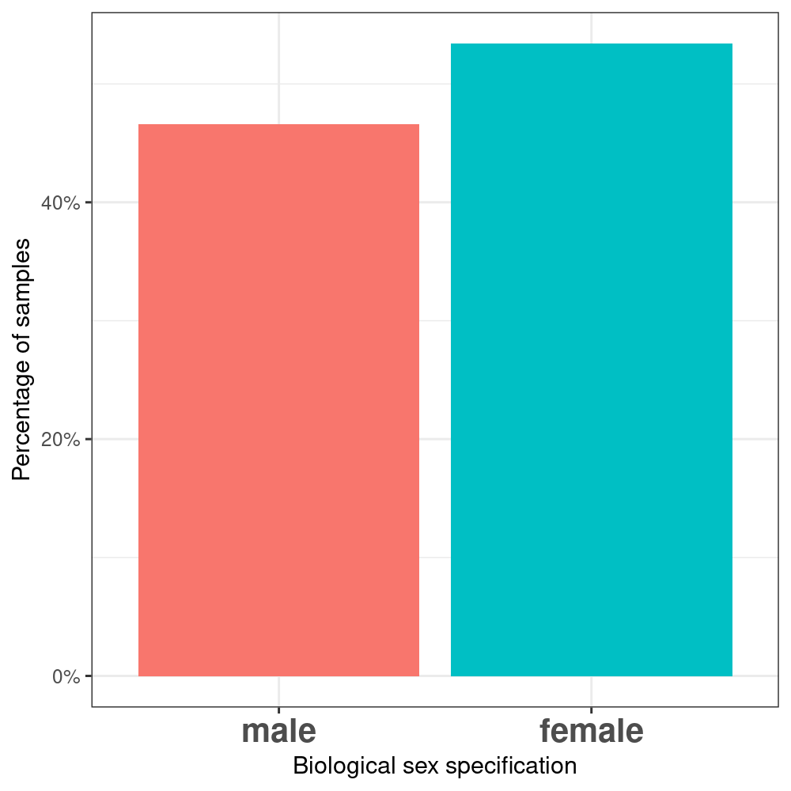
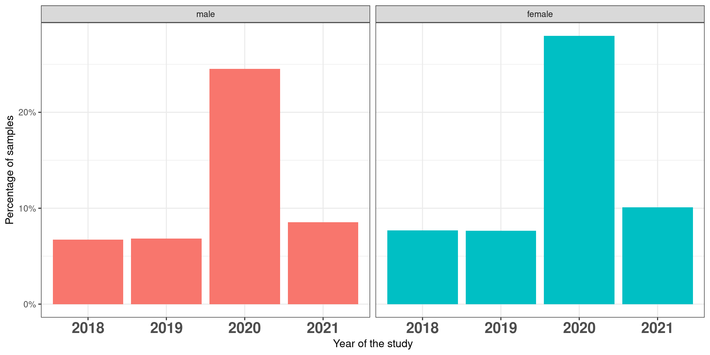

Gemma L. Holliday ORCiD: 0000-0002-6731-6398 Affiliation: Medicines Discovery Catapult (Address:Block 35, Mereside, Alderley Park, Macclesfield, Cheshire, SK10 4ZF)

# Abstract 
The design of AI systems for health is a grand achievement of science and technology of our times. Nevertheless, such systems learn to perform specific tasks by processing extensive amounts of data that is produced and stored in large biomedical repositories. The quality and content of this data have an immense impact on what and how AI learns. If the data contains biases, such as skewed representation of certain categories or missing information, the application of AI can lead to discriminatory outcomes and propagate them into society, as we recently pointed out [@cirillo2020sex]. The objective of this work is to determine the extent of biases in available demographic categories (sex, age, race) in ELIXIR biomedical data repositories, which are largely used in the community to train AI systems. Here, we quantify the bias and provide recommendations on how to properly use the data to develop fair and trustworthy AI, including solutions and best practices.

# Introduction 
				
In June 2015, the NIH announced that sex as a biological variable must be part of research design and analysis in studies of vertebrate animals and humans (NOT-OD-15-102).
Most funding agencies now have some level of requirements: https://genderedinnovations.stanford.edu/sex-and-gender-analysis-policies-major-granting-agencies.html Some have had this longer than others (WHO seems to date to 2002, whereas Korea is 2021)
Despite this, the data are still relatively poorly represented (results of quantitative analysis?)
We also need to consider other diversity criteria, such as socio-economic profile, ethnicity, etc. since the link between biology and health includes our environment as well as our genetics (not sure how to say this properly! Maybe conclusions?)
The one size fits all view of medicine is no longer considered the paradigm; instead it is well understood that the diversity of nature is replicated in our response to medications. Precision medicine, in which treatments are tailored to individuals only works if we have a decent understanding of the underlying inter-individual differences. (borrowing heavily from: https://europepmc.org/article/MED/32529043)
Machine learning (and Artificial Intelligence) are dependent on the data used to train the algorithms, if we feed biased data in, the results will be heavily biased. This was publicly highlighted early 2021 when an AI algorithm was fed a cropped image of a female congresswoman, and the completed picture was of a bikini clad woman (https://www.technologyreview.com/2021/01/29/1017065/ai-image-generation-is-racist-sexist/; https://arxiv.org/pdf/2010.15052.pdf). Ethics aside from using real people in such research, this demonstrates that a clear understanding of the underlying data is crucial in having results that can be trusted. Other examples of AI “getting it wrong” have been highlighted in facial recognition.
Another example https://arxiv.org/abs/1607.06520 in which “word embeddings trained on Google News articles exhibit female/male gender stereotypes to a disturbing extent”
And another: http://markyatskar.com//publications/bias.pdf 

examples of AI and gender bias (eg unclothing, image recognition...)				
include findings of the quantitative team		

# Methods
## Databases
Two independent databases were considered in the present investigation: EGA [@riccio2012ega] and dbGaP [@mailman2007ncbi], containing population from Europe and the United States, respectively (check this info).

### EGA
### dbGAP
We downloaded the xml files of all the studies from 2018 to present (date of creation) from https://ftp.ncbi.nlm.nih.gov/dbgap/studies/. The final list contained XXX xml files that we converted to tables reporting the information about the variables of interest.

dbGaP is a database that provides access to large-scale genetic and phenotypic datasets required for GWAS designs and provides authorized access to individual-level data.

Studies in dbGaP contain four basic types of data:
* Study documentation, including study descriptions, protocol documents, and data collection instruments, such as questionnaires;
* Phenotypic data for each variable assessed, at both an individual level and in summary form; 
* Genetic data, including study subjects' individual genotypes, pedigree information, fine mapping results, and resequencing traces; and 
* Statistical results, including association and linkage analyses, when available (copied from paper).

Here, we are mainly interested in the Phenotypic data.

Individuals in datasets are separately classified by sex, case-control status, and consent category.
Hence, changes in participant sets will alter the statistical summary of values and prompt the regeneration of all versions of data files to reflect the new consent structure.

# Analysis

## Quantitative Analysis 

Here we do a quantitative analysis to measure the data quality and find possible unbalance in sex that might lead to bias in the studies using this data.  
In 2018 EGA made the sex category mandatory for all submissions in the data.
Within this context we agreed to analyze all the studies made from 2018.

### EGA

In this section, the results from EGA are presented.  
An analysis from mainly all the studies from 2018 and after was made.
This presented:
- 704,732 unique samples
- 1487 studies
- 4289 phenotypes  
It is important to note that some studies include samples from before 2018.

### dbGaP
In this section, the results from dbGaP are presented.

- Considering all dates
  - Number of studies: 7,864
  - Number of samples (not unique): 18,502,714
- Considering date >= 2018:
  - Number of studies: 4,315 (2 times more studies than EGA)
  - Number of samples (not unique): 10,547,994 (almost 10 times more samples than in EGA). 

All the samples of this dataset are categorized by biological sex. No "unknown" samples are present.
Moreover, all studies (7,864) contain always both female and male data.

First, a quantification at the dataset level was performed.
 

	
Figure X. Percentage of male and female samples in dbGaP.

Figure X. Percentage of male and female samples in dbGaP per year.

Then, a quantification at study level was performed.

	
Figure X. Mean percentage of samples by sex included in all the studies.

## Qualitative Analysis 

### Content Analysis 

Table of results 

### Recommendations 

1. provide clear definitions of sex and gender. avoid confusion (EGA uses "gender" biological sex)		
		
2. mandatory field is not enough, often filled as "unknown". other actions need to be included (legal aspects, global recommendations, etc.) 	

			
3. education is essential to raise awareness on the importance of including diversity in the creation of datasets and in research practice ( by training in companies, institutions but also in the curriculum in courses of medicine, engineer, bioinformatics, etc... ) 			
	
	3.1 do we propose ideas/methods?			
	3.2 who should be included?		
3.2.1 We need to consider the levels of people included in such studies. From the researcher to the clinician and the participants.Different education levels and “trust” in authority.  
3.2.2. It’s also worth noting that clinical trials often fail due to too few participants; to drive innovation and discovery, we need to do better (https://www.ncbi.nlm.nih.gov/pmc/articles/PMC6092479/).
	3.3 trade-off between preserving the privacy of personal data and the necessity to include it to improve outcomes
		3.3.1 During the COVID pandemic the public demonstrated that they are willing to provide their data (https://www.nature.com/articles/s43018-020-0065-z), so what is different in a “standard” study, and those initiated during the pandemic? It is possible we will see a higher willingness to share post COVID. Of course, it’s possible we won’t too. See also https://idpjournal.biomedcentral.com/articles/10.1186/s40249-020-0622-9 for a review of crowdsourcing in health and medical research in general (2020).

Couple of interesting articles on sharing research data (probably not too relevant here):
https://repository.jisc.ac.uk/5662/1/KE_report-incentives-for-sharing-researchdata.pdf
https://scholarlykitchen.sspnet.org/2014/11/11/to-share-or-not-to-share-that-is-the-research-data-question/ 

4. social impact in biomedical research/precision medicine of not capturing the diversity				
5. not only ask for gender identification / ethnic... and start putting efforts on the genomic data and study its relation to biological sex or ethnicity 				
	5.1 what is in the genetics that makes a drug work differently for specific sex? -- a more systematic understanding of the biology that drives the different responses seen by different demographics.	
5.2 Can we automate the annotation of at least some of these data? For example, ethnicity and biological sex may be predictable from the genomic data gathered (e.g. dbGap use an automated tool called GRAF to check if the annotations in the data match predicted annotations (https://www.ncbi.nlm.nih.gov/projects/gap/cgi-bin/GRAF_README.html). DNA ancestry services such as 23andMe will predict ancestry based of the sample provided. We also have access to large and diverse datasets from the 1000 and 10,000 Genome initiatives. 
		
6. promote methods for transparency and accountability to foster open science/ open access, reusability, reduce the cost of creating/curating datasets				
	6.1 what happens with datasets that were created before gender was mandatory?			
	6.2 synthetic data?			
	6.3 user-friendly info to define the quality level of the dataset (eg., red-yellow-green)			

7. standardization of datasets to allow interoperability				
	7.1 avoid free text			
	7.2 ontologies for diseases / phenotypes ...			

# Discussion

# References
